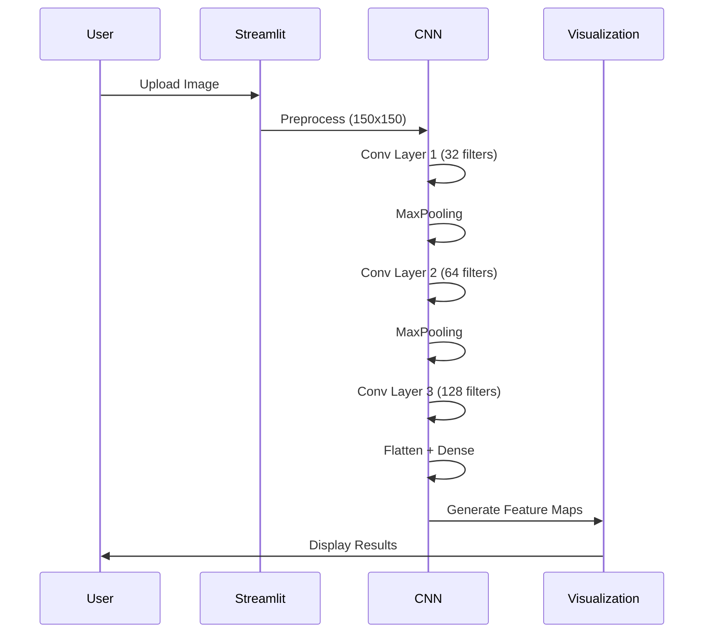
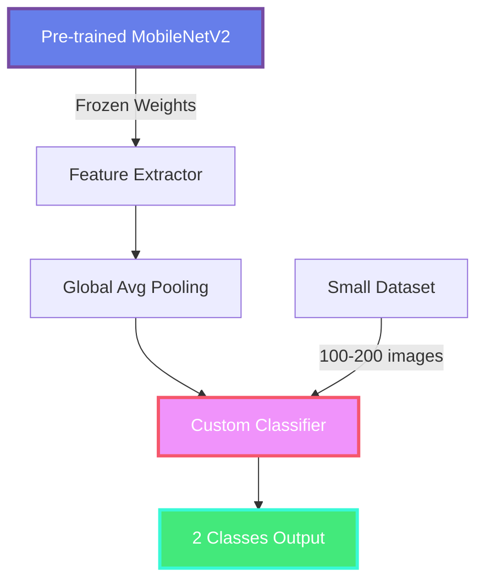

<div align="center">

# Deep Learning Image Classifier

[](https://streamlit.io/)
[](https://tensorflow.org/)
[](https://python.org/)
[](LICENSE)


</div>


## Overview

**Deep Learning Image Classifier** is an interactive educational platform designed to demystify how Convolutional Neural Networks (CNN) and Transfer Learning work. Built with Streamlit and TensorFlow, this application provides real-time visualizations of:

-  **Image Preprocessing** - See how images are transformed for neural networks
-  **RGB Channel Analysis** - Understand color composition in detail
-  **Convolution Operations** - Watch filters extract features in real-time
-  **Feature Maps** - Visualize what each layer "sees"
-  **Prediction Confidence** - Interactive probability distributions
-  **Model Architecture** - Complete network structure breakdown

<div align="center">


</div>

---

##  Features

<table>
<tr>
<td width="50%">

### 🎓 Educational Focus
- **Step-by-step Learning**: Progressive visualization from input to output
- **Interactive Explanations**: Understand every layer and operation
- **Real-time Processing**: See how models process your images
- **Comprehensive Documentation**: In-depth explanations of concepts

</td>
<td width="50%">

### 🛠️ Technical Features
- **Dual Model Architecture**: CNN & Transfer Learning comparison
- **Advanced Visualizations**: Plotly-based interactive charts
- **RGB Matrix Analysis**: Detailed color channel heatmaps
- **Feature Map Extraction**: View intermediate layer outputs

</td>
</tr>
</table>

---

##  Models

### 1️ CNN Classification - Rock Paper Scissors

<details open>
<summary><b>📋 Click to expand details</b></summary>

<br>

**Purpose**: Classify hand gestures into Rock, Paper, or Scissors using a custom CNN architecture

**Architecture**:
```
Input (150x150x3)
    ↓
Conv2D (32 filters, 3x3) + ReLU + MaxPooling
    ↓
Conv2D (64 filters, 3x3) + ReLU + MaxPooling
    ↓
Conv2D (128 filters, 3x3) + ReLU + MaxPooling
    ↓
Flatten + Dropout (0.5)
    ↓
Dense (512) + ReLU
    ↓
Output (3 classes) + Softmax
```

**Key Features**:
-  RGB channel visualization
-  5 different convolution filters (Edge Detection, Sharpen, Blur, etc.)
-  Feature maps from all convolutional layers
-  Interactive probability distribution

**Dataset**: Rock Paper Scissors hand gestures  
**Input Size**: 150×150 pixels  
**Classes**: 3 (Rock, Paper, Scissors)

</details>

---

### 2️ Transfer Learning - MobileNetV2 (Cheetah vs Hyena)

<details open>
<summary><b> Click to expand details</b></summary>

<br>

**Purpose**: Distinguish between Cheetahs and Hyenas using pre-trained ImageNet model

**Architecture**:
```
Input (224x224x3)
    ↓
MobileNetV2 Base (ImageNet, Frozen)
    ↓  [2.2M parameters]
Global Average Pooling (7x7x1280 → 1280)
    ↓
Dense (128) + ReLU
    ↓
Dropout (0.5)
    ↓
Output (2 classes) + Softmax
```

**Key Features**:
-  Pre-trained on ImageNet (14M images, 1000 classes)
-  Frozen base model for feature extraction
-  Pixel intensity distribution histograms
-  Top 30 most important features visualization
-  Depthwise Separable Convolutions explained

**Dataset**: Cheetah vs Hyena images  
**Input Size**: 224×224 pixels  
**Classes**: 2 (Cheetah, Hyena)  
**Base Model**: MobileNetV2 (ImageNet weights)

</details>

---

##  Quick Start

### Prerequisites

```bash
Python 3.8+
pip (Python package manager)
```

### Installation

1️ **Clone the repository**
```bash
git clone https://github.com/yourusername/deep-learning-classifier.git
cd deep-learning-classifier
```

2️ **Install dependencies**
```bash
pip install -r requirements.txt
```

3️ **Run the application**
```bash
streamlit run app.py
```

4️ **Open your browser**
```
Navigate to: http://localhost:8501
```

---

##  Project Structure

```
deep-learning-classifier/
│
├──  app.py                      # Main Streamlit application
├──  pages/
│   ├── 1_CNN.py                   # CNN Classification page
│   └── 2_MobileNetV2.py           # Transfer Learning page
│
├──  models/
│   ├── classificationCNN.ipynb    # CNN training notebook
│   └── MobileNetv2.ipynb          # Transfer Learning notebook
│
├──  .streamlit/
│   └── config.toml                # Streamlit configuration
│
├──  requirements.txt            # Python dependencies
├──  packages.txt                # System dependencies
└──  README.md                   # This file
```

---

##  Technology Stack

<div align="center">

| Category | Technologies |
|----------|-------------|
| **Framework** |  |
| **Deep Learning** |   |
| **Data Processing** |   |
| **Visualization** |  |
| **Image Processing** |  |

</div>

---

##  Model Performance

<div align="center">

### CNN Model (Rock Paper Scissors)

| Metric | Score |
|--------|-------|
| Training Accuracy | ~95% |
| Validation Accuracy | ~92% |
| Parameters | ~500K |
| Input Size | 150×150×3 |

### Transfer Learning (Cheetah vs Hyena)

| Metric | Score |
|--------|-------|
| Training Accuracy | ~98% |
| Validation Accuracy | ~96% |
| Parameters | 2.2M (frozen) + 163K (trainable) |
| Input Size | 224×224×3 |

</div>

---

##  Learning Objectives

<table>
<tr>
<td>

- How convolutional layers extract features
- Role of pooling in dimension reduction
- Activation functions and non-linearity
- Classification with fully connected layers

</td>
<td>

- Leveraging pre-trained models
- Feature extraction vs fine-tuning
- Adapting models to new tasks
- Efficient training with limited data

</td>
</tr>
</table>

---

##  Visual Examples

### CNN Workflow Visualization



### Transfer Learning Comparison



---

##  How It Works

### Image Processing Pipeline

1. **Input**: User uploads an image
2. **Preprocessing**: Resize and normalize image
3. **RGB Analysis**: Separate and visualize color channels
4. **Convolution**: Apply filters to extract features
5. **Feature Maps**: Visualize intermediate representations
6. **Classification**: Dense layers produce predictions
7. **Output**: Display probabilities and visualizations

### Interactive Features

- **Real-time Sliders**: Adjust visualization parameters
- **Filter Selection**: Choose from 5 convolution kernels
- **Feature Map Gallery**: View all extracted features
- **Confidence Meters**: Interactive probability charts
- **Heatmap Analysis**: Detailed RGB channel inspection


---


##  Acknowledgments

- **TensorFlow/Keras** for deep learning framework
- **Streamlit** for the amazing web framework
- **Plotly** for interactive visualizations
- **Rock Paper Scissors Dataset** for training data
- **ImageNet** for pre-trained weights


</div>
